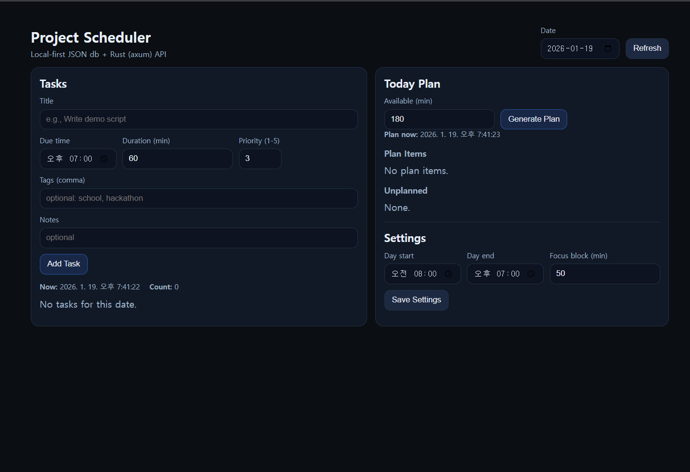

# Project_Scheduler

A local-first task scheduler implemented with **Rust**, designed to generate a prioritized daily plan based on urgency, priority, and estimated duration.

This project was built as a hackathon-style MVP, focusing on **clear architecture**, **deterministic scheduling logic**, and **ease of use without external services**.

---

## Overview

Project_Scheduler helps users answer a simple but practical question:

> **“Given my tasks and limited time today, what should I work on first?”**

Instead of relying on cloud services or complex databases, this project uses:
- A **Rust backend** with a JSON-based local database
- A **deterministic scoring algorithm** for task prioritization
- A lightweight **frontend served directly by the backend**

---
## Demo Screenshot

**Main interface of Project Scheduler.**  
Tasks are created and managed on the left, while the backend-generated daily plan is displayed on the right.  
Overdue tasks are visually highlighted, and users can dynamically regenerate plans based on available time.

---
## Key Features

- 🗂 **Task Management**
  - Create, update, delete tasks
  - Toggle task status (Todo → In Progress → Done)
  - Store tasks locally in `db.json`

- 🧠 **Smart Daily Planning**
  - Scores tasks using:
    - **Urgency** (how close or overdue the due date is)
    - **Priority** (user-defined importance)
    - **Duration** (shorter tasks slightly favored)
  - Automatically builds a time-ordered daily plan
  - Separates tasks that cannot fit into today’s schedule

- 🕒 **Time-Aware Scheduling**
  - Respects configurable day start/end times
  - Honors user-provided available minutes for the day
  - Marks overdue tasks explicitly

- 🌐 **Simple Web UI**
  - View and manage tasks
  - Generate today’s plan with one click
  - Update day-level settings
  - No external frontend framework required

---

## Architecture
Frontend (HTML / CSS / JS)
↓
Axum HTTP API
↓
Scheduling Logic (logic.rs)
↓
Local JSON Storage (db.json)

### Backend Structure

- `main.rs`  
  Entry point. Sets up the Axum server, routes, and static file serving.

- `models.rs`  
  Core data models (`Task`, `TaskStatus`, `DaySettings`, `Db`).

- `logic.rs`  
  Pure scheduling logic:
  - Task filtering
  - Scoring and sorting
  - Daily plan construction

- `routes_tasks.rs`  
  REST API for task CRUD operations and settings management.

- `routes_plan.rs`  
  REST API for generating today’s plan.

- `store.rs`  
  Handles loading and saving the local JSON database safely.

### Frontend Structure

- `static/index.html`  
  Static UI layout.

- `static/app.js`  
  Frontend logic:
  - Handles user interactions
  - Calls backend APIs
  - Renders tasks and plans dynamically

- `static/styles.css`  
  Minimal styling for a clean demo-friendly UI.

---

## Scheduling Logic (High-Level)

1. **Filter relevant tasks**
   - Exclude completed tasks
   - Include tasks that are overdue or due today

2. **Score each task**
   - Urgency: 0–5 (overdue tasks get highest score)
   - Priority: 1–5 (user-defined)
   - Duration score: favors shorter tasks
   - Total score = urgency + priority + duration score

3. **Sort tasks**
   - Higher total score first
   - Tie-breaker: alphabetical order by title

4. **Build today’s plan**
   - Start at `max(current_time, day_start)`
   - Stop at `day_end` or when available time runs out
   - Tasks that do not fit are marked as *unplanned*

---

## API Endpoints

### Tasks
- `GET /api/tasks`
- `POST /api/tasks`
- `PUT /api/tasks/:id`
- `DELETE /api/tasks/:id`
- `POST /api/tasks/:id/toggle`

### Plan
- `GET /api/plan/today?date=YYYY-MM-DD&available_min=NUMBER`

### Settings
- `GET /api/settings`
- `PUT /api/settings`

---

## Running the Project

### Prerequisites
- Rust (stable)
- Cargo

### Run Locally
cargo run

### Server output will display: 
"Server running at http://127.0.0.1:3000"

---

## Future Improvements
- Focus-block based scheduling with automatic breaks
- Task pinning / exclusion for daily planning
- Visual timeline view for today’s plan
- Persistent user profiles or database backend